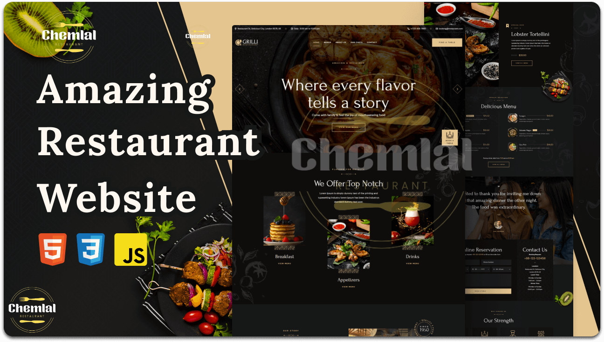

   
   

  <h2 align="center">ChemlalFood - Restaurant Website</h2>

ChemlalFood is a fully responsive restaurant website,  Responsive for all devices, build using HTML, CSS, and JavaScript.

  <a href="https://codewithsadee.github.io/grilli/"><strong>➥ Live Demo</strong></a>
   
   
  <a href="https://www.youtube.com/watch?v=gobLRDxGsvs" rel="nofollow"><strong>➥ Video Youtube</strong></a>
  

 

### Demo Screeshots

### Prerequisites

Before you begin, ensure you have met the following requirements:

* [Git](https://git-scm.com/downloads "Download Git") must be installed on your operating system.
